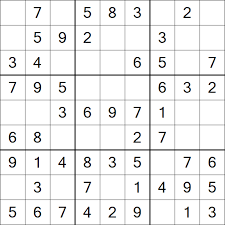

### Sudoku Solver and Validator

The Sudoku class provides functionality to validate, display, and solve Sudoku puzzles. It includes methods to:

1. **Validate Sudoku Puzzles**: The checkSudoku method verifies if a Sudoku grid adheres to the game's rules. It checks that each number from 1 to 9 appears exactly once in each row, column, and 3x3 subgrid. It also ensures that the grid dimensions are correct and that there are no illegal values (i.e., numbers outside the 1-9 range). Errors can be printed for debugging purposes.

2. **Convert Sudoku to String**: The toString method formats the Sudoku grid into a readable string format, making it easy to visualize the puzzle and check for errors. The grid is displayed with boundaries separating the 3x3 subgrids, and cells with value 0 are shown as empty.

3. **Solve Sudoku Puzzles**: The fillSudoku method attempts to solve the Sudoku puzzle using a backtracking approach. It fills empty cells (denoted by 0) with numbers from 1 to 9, ensuring that the grid remains valid after each assignment. If a valid solution is found, the grid is updated accordingly. If no solution is possible, the grid is reverted to its original state.

The SudokuTest class contains methods to test the functionality of the Sudoku class. It includes:

1. **Test Sudoku Solving**: The testSudoku method evaluates whether the Sudoku class correctly solves various Sudoku puzzles. It checks if the solution is complete and valid, comparing it against provided solutions if available.

2. **Comparison of Sudoku Grids**: The sameSudoku method compares two Sudoku grids and identifies discrepancies, producing a new grid that highlights where the solutions differ.

The SudokuTest class demonstrates the solver's capabilities with multiple Sudoku examples, including both standard and challenging puzzles.

In summary, this program is a comprehensive tool for working with Sudoku puzzles, offering validation, visualization, and solving capabilities.

Source: <a href="https://github.com/jogarces/ics-313-text-game"><i class="large github icon "></i>jogarces/ics-313-text-game</a>
